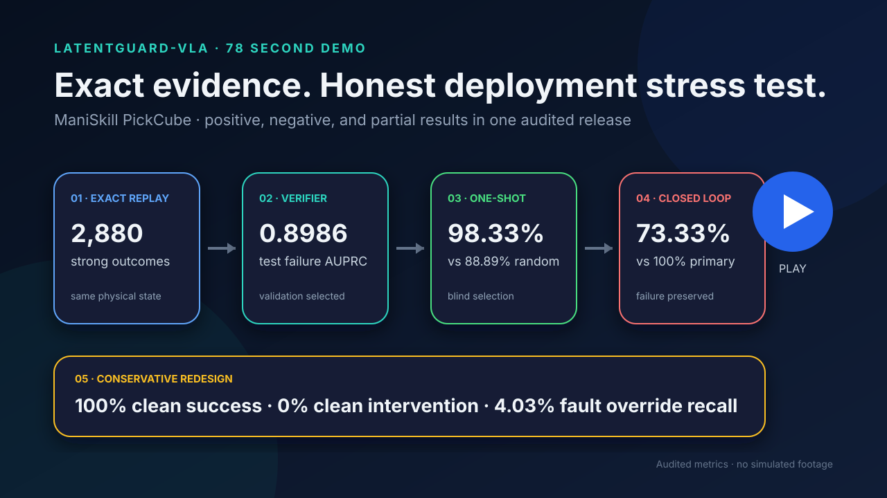
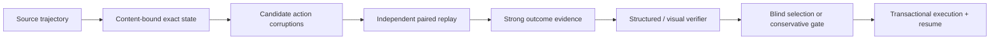

# LatentGuard-VLA

**[Stable release](https://github.com/Yanagisawa2002/LatentGuard-VLA/releases/tag/portfolio-v1)** · **[ManiSkill PickCube scope](#limitations)** · **[Audited claims](docs/release/claims.md)**

**[Watch the 78-second demo](https://github.com/Yanagisawa2002/LatentGuard-VLA/releases/download/portfolio-v1/latentguard-vla-78s-demo.mp4)** · **[Read the case study](docs/portfolio/case-study.md)** · **[Inspect the evidence registry](docs/release/results.json)**

[](https://github.com/Yanagisawa2002/LatentGuard-VLA/releases/download/portfolio-v1/latentguard-vla-78s-demo.mp4)

LatentGuard-VLA is an action-conditioned verification and failure-analysis framework for robot policies. It builds content-bound counterfactual evidence from exact simulator states, learns structured and visual action verifiers, and tests whether those verifiers can improve action choice. On ManiSkill PickCube, blind one-shot selection was strong and robust to fixed visual shifts; repeated intervention then exposed a deployment failure, and a conservative redesign recovered nominal behavior with only a limited injected-fault benefit. The project is technically significant because the negative result is preserved alongside the positive result under the same typed evidence, replay, and recovery contracts.

**Achieved:** physically validated paired replay, 2,880 strong simulator-verified corrupted outcomes, validation-selected failure prediction, blind one-shot improvement over random, state-preserving multi-view data, and transactional large-run resume. **Not achieved:** a general safety system, repeated learned shielding that beats the fixed primary, high-recall fault interception, cross-task transfer, or real-robot validation.

## Problem

A robot policy can emit a plausible action chunk that fails after execution. Evaluating only nominal rollouts hides the counterfactual question: from the same physical state, which alternative action would have produced a better terminal outcome? LatentGuard separates that question into explicit contracts for state identity, candidate generation, paired replay, evidence strength, deployable features, blind selection, and transactional execution.

## Main contributions

- Generic exact-state paired replay with independent baseline/corrupted sessions, exact archive integrity, and adapter-bound complete-state comparison.
- A 60-trajectory, 360-anchor PickCube dataset with 2,880 strong simulator-verified corrupted outcomes and trajectory-level split integrity. <!-- LG-RESULT:m2c-strong-replays --> <!-- LG-RESULT:m3a-verified-outcomes -->
- Structured and visual verifier evaluation with validation-only selection, untouched test/external evaluation, calibration, ranking, and coverage-risk reporting. <!-- LG-RESULT:m3b-test-auprc -->
- Blind one-shot selection that beat random, followed by a deliberately honest receding-horizon negative result. <!-- LG-RESULT:m3c-temporal-success --> <!-- LG-RESULT:m4b-external-visual-success --> <!-- LG-RESULT:m4c-distilled-vs-fixed -->
- A conservative fallback-aware redesign that preserved clean success but intercepted only 4.03% of injected-fault override opportunities. <!-- LG-RESULT:m4d-fault-gated-success --> <!-- LG-RESULT:m4d-override-recall -->
- Content digests, exact-SHA remote execution, immutable source artifacts, transactional publication, crash recovery, and zero-work resume.

## Architecture



The detailed [architecture guide](docs/portfolio/architecture.md) shows the data/evidence, training/evaluation, closed-loop, and release-evidence graphs.

## Key validated results

| Stage | Result | Interpretation |
| --- | --- | --- |
| M2C–M3A | 12/12 trusted replay attempts and 2,880 accepted corrupted outcomes | Physical replay and evidence generation worked in the pinned PickCube scope. |
| M3B | Selected temporal verifier untouched-test failure AUPRC **0.8986** | Structured state+action failure was learnable; no cross-task claim. |
| M3C | Temporal one-shot success **98.33%** vs random **88.89%**; 95% difference CI **[6.39, 12.50] pp** | Blind selection improved one-shot action choice, although joint MLP reached 99.44%. |
| M4B | External visual one-shot success **98.89%**; strong camera/light shifts **98.06%** | Robust to the fixed rendered shifts; visual-minus-action-only CI included zero. |
| M4D | Clean success **100%**, clean intervention **0%** | Conservative gating preserved the tested nominal behavior. |

The canonical positive, partial, and negative table is [docs/portfolio/key-results.md](docs/portfolio/key-results.md).

## Honest negative results

M4C showed that one-shot ranking did not transfer automatically to repeated intervention. The distilled visual selector achieved **73.33%** canonical success versus **100%** for the fixed primary, a **-26.67 percentage-point** difference, while selecting non-primary candidates on **93.48%** of decisions. M4D reduced fault-schedule intervention to **1.17%** and raised success from **73.33%** (accept nominal) to **80.00%**, but remained below ungated direct (**90%**) and always fallback (**100%**); override recall was only **4.03%**. M4D therefore passed 10/14 targets and is a partial engineering success, not a completed research claim.

## Repository structure

- `src/latentguard/`: simulator-independent data, corruption, evidence, replay, selection, visual, control, and release modules.
- `configs/`: versioned semantic configurations; no credentials or machine-private paths.
- `tests/`: CPU core tests plus explicitly marked integration/GPU boundaries.
- `reports/`: compact sanitized accepted evidence; no raw states, images, datasets, caches, or checkpoints.
- `docs/release/`: authoritative milestone, claim, result, and release-manifest registries.
- `docs/portfolio/` and `docs/career/`: technical report, case study, diagrams, demo plan, and employment-ready summaries.

## Reproducibility

Install Python 3.11 and the development dependencies, then run:

```bash
python -m pip install -e ".[dev]"
python -m pytest
ruff check .
ruff format --check .
mypy src
latentguard audit-release --strict
```

Large accepted datasets, images, states, checkpoints, and caches remain outside Git. Their continued availability is audited separately without making the ordinary local suite depend on a server.

## Quick smoke

```bash
latentguard portfolio-smoke
```

This deterministic CPU command exercises synthetic source generation, corruption, non-physical fixture replay, weak evidence projection, a compact verifier/selection fixture, zero-work resume, and release-registry loading. It is explicitly **not** a simulator or research-result reproduction.

## Evidence and claims

Every published number maps to a committed report, exact file digest, execution commit, run ID, and JSON pointer in [results.json](docs/release/results.json). Public wording is governed by [claims.json](docs/release/claims.json) and its [readable view](docs/release/claims.md). Run `latentguard audit-release --strict` to verify references, digests, result values, links, public-surface hygiene, and unsupported-claim boundaries.

## Limitations

The accepted research line covers one ManiSkill PickCube task, one robot/controller contract, synthetic action corruptions, fixed candidate pools, fixed rendered domains, and controlled injected faults. It does not establish general safety, real-robot robustness, VLA generalization, arbitrary replanning, hardware-fault detection, cross-task/robot transfer, language-conditioned verification, or LangMani improvement.

## Future integrations

Potential extensions include learned-policy proposals, a contract-frozen LangMani adapter, multiple task adapters, broader robot embodiments, and real-robot evaluation. Each requires a new milestone, untouched evidence, and its own compatibility and claim boundary.

The PickCube release remains frozen. M6A and M6A.1 completed only the LangMani contract, bridge scaffolding, compatibility inventory, and readiness checks. A real LangMani integration probe and performance experiment have **not** executed, and M6B has not started. See the [LangMani compatibility matrix](docs/integrations/langmani/compatibility-matrix.md) for the source-backed status and unresolved gates.

The separately authorized WM-v0 P0.1 repair remains frozen as its historical
**Result B**. The follow-up P0.2 temporal/gripper/phase investigation is now
complete as **Result C**. P0.2 preserved the same native `affine_tanh_v1` ACT
action contract, found no timestamp defect, removed the global gripper endpoint
collapse, and improved the selected full checkpoint to 28/30 pre-grasp entries
and 20/30 valid near-object closes. It nevertheless produced only one verified
grasp, which dropped before lift, and 0/30 task successes. The unchanged 75%
promotion gate therefore failed. Final seeds remain sealed, no `PolicyPackage`
exists, the D2 registry has zero accepted policies, and the D2 policy-generated
pilot remains blocked. See the
[bounded-action audit](docs/pickcube_act_bounded_audit.md),
[training report](docs/pickcube_act_bounded_training_report.md),
[evaluation report](docs/pickcube_act_bounded_evaluation_report.md), and
[controlled P0/P0.1 comparison](docs/pickcube_act_p0_vs_p01.md), plus the P0.2
[alignment audit](docs/pickcube_act_temporal_alignment_audit.md),
[training report](docs/pickcube_act_p02_training_report.md),
[evaluation report](docs/pickcube_act_p02_evaluation_report.md), and
[P0.1/P0.2 comparison](docs/pickcube_act_p01_vs_p02.md).

Key P0.1/P0.2 structural commands are:

```bash
python scripts/audit_pickcube_action_pipeline.py --help
python scripts/validate_bounded_action_transform.py --help
python scripts/train_pickcube_act.py --help
python scripts/screen_pickcube_act_bounded_checkpoints.py --help
python scripts/run_pickcube_act_bounded_development.py --help
python scripts/evaluate_pickcube_act.py --help
python scripts/package_pickcube_policy.py --help
```

## Development and remote execution policy

Tracked source, tests, configs, and reports are authored and validated locally, committed, and pushed. Remote execution may use only that exact clean SHA and writes large artifacts outside the tracked tree. Bugs are fixed locally and resynchronized; remote-only tracked-source edits are invalid. Server lifecycle is controlled only by explicit authorization in the current task.
