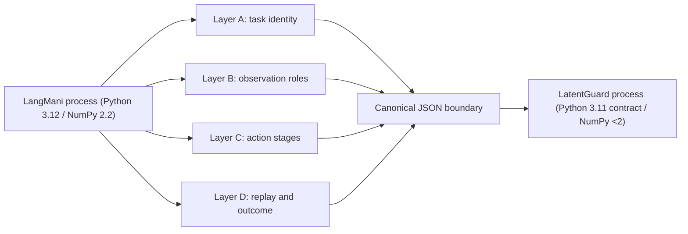

# LangMani integration architecture

## Boundary

The integration is optional. Core LatentGuard modules never import LangMani at
module import time. The two repositories exchange versioned, canonical JSON
records through a process boundary, which also isolates their incompatible
Python and NumPy pins.



Hosts, checkout paths, output directories, timestamps, process IDs, simulator
objects, and raw checkpoint bytes are excluded from semantic identity.

## Layer A: task identity

`LangManiTaskContextV1` keeps raw instruction text, normalized task ID, object,
goal, policy conditioning, simulator task configuration, and reporting labels
separate. The current task ID semantic is
`langmani-pick-place-task-v0:<object>:<bin>:canonical_v0`, covering three cubes by
two bins. The first integration uses accepted PerTask controllers, so task text
is identity/reporting context rather than a learned verifier input.

Identity-only, model-input, and reporting-only field allowlists are disjoint.
The schema rejects an instruction accidentally added to the first-integration
model-input allowlist.

## Layer B: observation

`LangManiObservationEnvelopeV1` stores field contracts and four disjoint payload
maps. Simulator restoration state is represented only by a digest.

| Field | dtype / shape | Role | Frame / units | Normalization and cadence | Restore behavior |
| --- | --- | --- | --- | --- | --- |
| `base_camera` RGB | `uint8[256,256,3]` | required policy input | base camera / intensity | saved image preprocessor, 20 Hz | reconstructed after semantic reset + state restore, but M6A ran no render probe |
| `PandaPolicyStateV0` | `float32[9]` | required policy input; potential verifier input | joint coordinates / rad or m | saved state preprocessor, 20 Hz | reconstructable from robot qpos |
| canonical task one-hot | `float32[6]` | policy input only for the mixed one-hot variant | task identity / unitless | identity basis, episode constant | reconstructable from `TaskSpec` |
| `tcp_pose` | `float32[7]` | unresolved verifier candidate | world pose / m + quaternion | none, 20 Hz | state-derived, not frozen as verifier input |
| cube poses | `float32[3,7]` | privileged verifier-only candidate | world / m + quaternion | none, 20 Hz | dynamic actors are in simulator state |
| bin centers | `float32[2,3]` | privileged verifier-only candidate | world / m | none, episode constant | static actors are omitted by ManiSkill state and require semantic reset |
| target object index | integer scalar | prohibited learned input | task identity | none, episode constant | reconstructable from `TaskSpec` |
| target bin index | integer scalar | prohibited learned input | task identity | none, episode constant | reconstructable from `TaskSpec` |
| simulator state tree | numeric/bool tree | restoration-only | simulator native | none, boundary state | `set_state_dict`/`get_state_dict` full-tree audit at `1e-6` |
| instruction text | UTF-8 string | identity/reporting only | not applicable | no embedding in M6A | reconstructable from task template |
| task/outcome diagnostics | boolean mapping | reporting/prohibited learned input | task evaluator | per step / terminal | never accepted as a proposal model input |

The compact verifier vector remains blocked. M6A does not concatenate all
available fields or authorize privileged target indices.

## Layer C: action proposal

The accepted ACT model contract is RGB plus 9D Panda state, a generated chunk of
`float32[50,8]`, one observation step, no temporal ensemble, and a deployed queue
that executes 10 actions per query at 20 Hz. The eight components are seven Panda
joint-position targets followed by the gripper mimic command.

Saved LeRobot pre/postprocessors own MEAN_STD normalization and inversion. After
inversion, the value is a raw environment-semantic action. The active environment
owns these bounds:

```text
low  = [-2.8973000, -1.7628000, -2.8973000, -3.0718000,
        -2.8973000, -0.0175000, -2.8973000, -1.0]
high = [ 2.8973000,  1.7628000,  2.8973000, -0.0698000,
         2.8973000,  3.7525001,  2.8973000,  1.0]
```

Projection occurs after saved postprocessing and immediately before `env.step`.
It is deterministic, per-component `min(max(raw, low), high)`, and depends on the
active action-space contract but not on task outcome. Malformed and non-finite
actions hard-fail. Per-step records retain raw action, executed action, bounds,
violation mask, projection metrics, dtype, shape, mode, and step.

`raw_policy_proposal`, `projected_executable_proposal`, and
`actually_executed_action_sequence` have different schema stages and different
content identities. Raw actions are replayable only when valid under the bound
contract. Projected actions are executable/replayable under the same environment
contract. Accepted physical evidence shows projection was common and confined to
the gripper in the M5A final. Official success therefore reflects executed,
potentially projected actions; strict unprojected success is a separate metric.

The initial integration policy is explicit: preserve **both** raw postprocessed
policy evidence and projected executable evidence, score neither silently, and
defer which representation drives M6B selection until the M6B candidate contract
is reviewed and frozen.

## Layer D: replay and outcome

LangMani's accepted action replay performs the authoritative seeded semantic
reset, verifies the initial full state, replays recorded `float32[8]` actions
unchanged, checks official terminal evidence and final pose/joint tolerances, then
audits every recorded state through `set_state_dict` -> `get_state_dict` with
complete-tree key/shape/finite checks and maximum absolute tolerance `1e-6`.

This does not serialize the ACT action queue, pre/postprocessor history, wrapper
state, observation history, episode RNG, or renderer state as one policy snapshot.
Nor does accepted evidence execute paired alternatives from each restored
intermediate state. Replay readiness is therefore `initial_state_only`, not
`exact_ready`.

Evidence preserves success, task failure, horizon exhaustion, projection failure,
invalid action, execution error, indeterminate, and skipped statuses. Official
success requires the target in the correct bin, no wrong object in that bin,
release, static target, and target on the table. The official `fail` flag covers
target off-table. Timeout/truncation, invalid action, inference failure,
environment failure, and other unsuccessful endings stay distinct. Any later
binary training projection must be a separate derived record.

## Candidate-source inventory

| Future source | Available now | Deterministic | Executable | Retraining | Leakage risk | Blind selection | Intended role |
| --- | --- | --- | --- | --- | --- | --- | --- |
| Multiple stochastic proposals | no frozen stochastic inference contract | unresolved | after projection | no | seed/outcome timing | blocked | possible future source |
| Checkpoint ensemble | six task-specific checkpoints exist, not same-task alternatives | deterministic by binding | yes | no | task identity leakage | unsuitable as-is | analysis only |
| Task-conditioning alternatives | technically constructible | yes | yes | no | deliberately wrong task | unsafe/high | analysis baseline only |
| Action-space corruptions | LatentGuard machinery reusable | yes when frozen | after projection | no | schedule tuning | possible after freeze | candidate option, not implemented |
| Raw versus projected variants | both observable | yes | raw often invalid; projected valid | no | representation ambiguity | unsuitable as sole pool | paired evidence streams |
| Trusted expert fallback | expert exists but policy path excludes it | deterministic only with its contract | yes | no | privileged/oracle leakage | no | analysis/fallback only |
| Nominal plus bounded perturbations | constructible | yes when frozen | after projection | no | perturbation tuning | possible after freeze | candidate option, not implemented |

No row authorizes a candidate pool in M6A.

## Continuation inventory

| Semantic | Implementable | Reproducible now | Deployment fidelity | Exact paired replay | Shift / cost |
| --- | --- | --- | --- | --- | --- |
| Execute chunk, resume same policy | yes | no at intermediate boundaries | high | blocked by queue/history snapshot | low shift, high state burden |
| Execute prefix, requery policy | yes | deterministic only after queue reset is declared | plausible receding horizon | not accepted | moderate shift, moderate cost |
| Execute chunk, recorded nominal continuation | yes for recorded episodes | yes for fixed data | lower for deployment | possible from initial reset | continuation mismatch, low inference cost |
| Execute chunk, expert fallback | technically yes | expert-dependent | low for deployed ACT | possible if separately bound | strong oracle shift, high cost |
| Execute one action, replan | yes | no accepted policy-state snapshot | plausible | blocked | largest query cost |

M6A selects no outcome-label continuation semantic.

## M6A.1 bounded action-only bridge

M6A.1 resolves only the initial-state integration smoke. LangMani exports raw postprocessed and
projected executable action identities; LatentGuard transforms only the raw ten-action prefix;
LangMani projects every transformed prefix with its existing action-bound implementation; and
LatentGuard scores only projected actions plus the fixed boolean mask.

`LangManiActionOnlyVerifierInputV1` has shape `[4,16,8]`, float32 model values, the first ten slots
from executable projected actions, exact zero padding in slots 10 through 15, and mask values true
then false over the same ranges. The scorer adapter creates only a constant internal placeholder
for the legacy model function's ignored state argument. No LangMani structured state, RGB, task,
instruction, provenance, projection count, fault identity, or outcome reaches the action-only
model.

The mandatory equivalence contract is bitwise equality of float64-exported logits and calibrated
probabilities after replacing only masked input padding with deterministic finite nonzero values.
There is no post-observation tolerance adjustment.

The implementation and fixture gates pass, but the accepted-artifact gate was not run on the
current server because its LangMani registry, runtime-selection record, checkpoint, and processor
artifacts are absent. No real proposal, projected candidate, candidate-pool digest, scorer result,
or blind ranking exists. The bounded contract remains frozen and `blocked`; fixture equivalence is
not reported as accepted-ensemble mask invariance.
