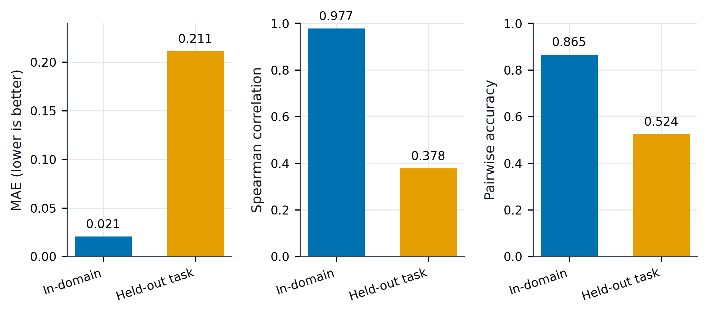
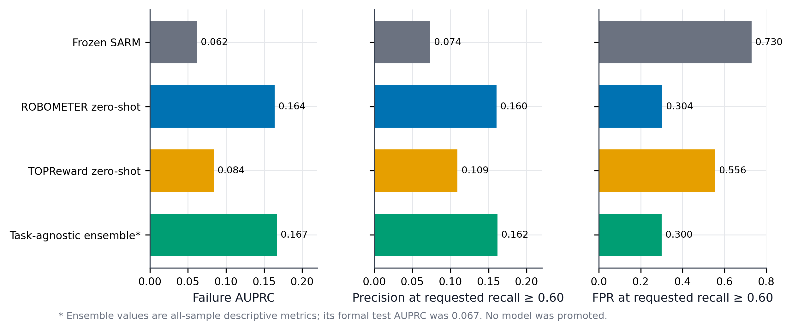
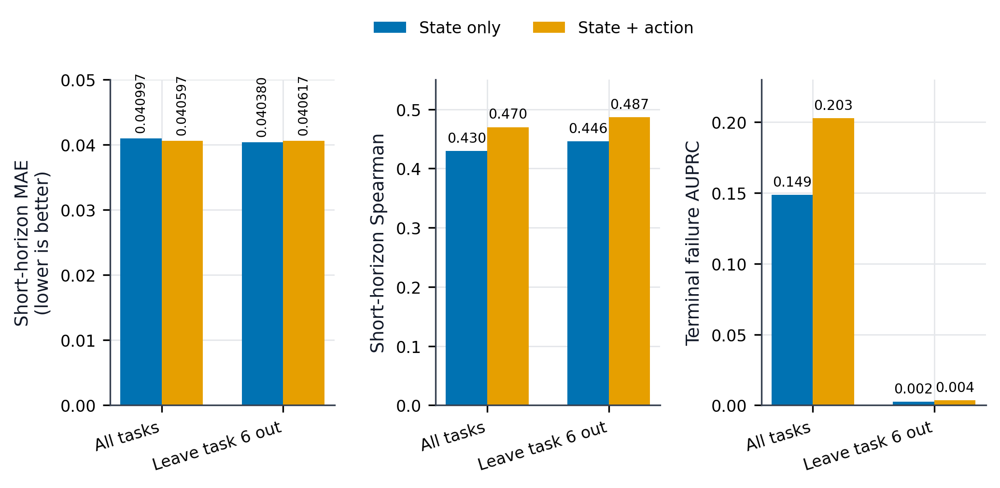
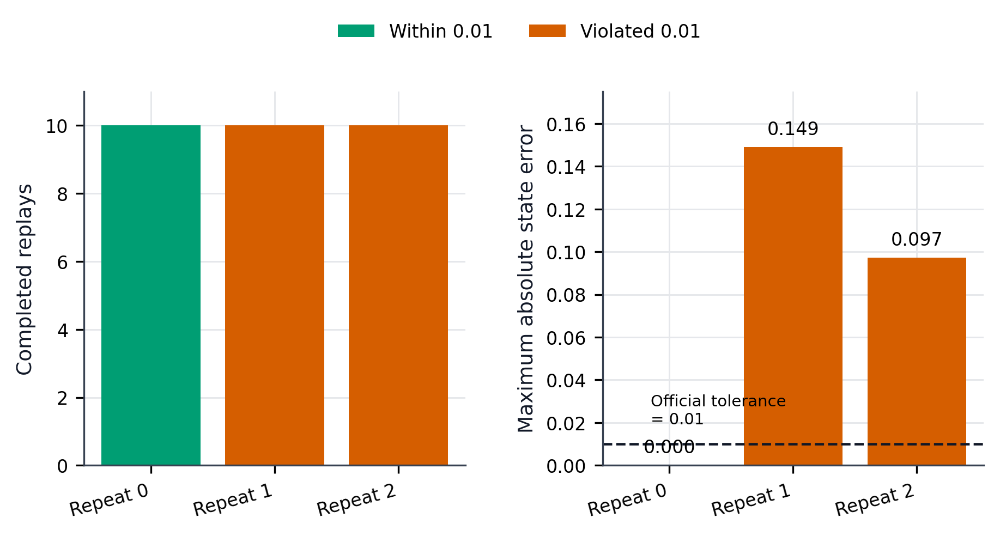
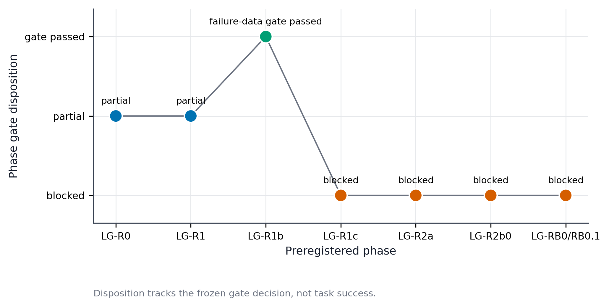

# LatentGuard-VLA Final Research Report

`Research closeout` · `Counterfactual VLA verifier not validated` ·
`No online intervention claim`

## Abstract

LatentGuard-VLA is a preregistered empirical study of whether VLA actions can be
verified before execution using progress models, task-agnostic reward models,
numeric action conditioning, and simulator counterfactual replay.

Across 320 multi-task LIBERO episodes, task-specific progress modeling collapsed
from 0.977 to 0.378 Spearman correlation on held-out tasks; the best standalone
zero-shot task-agnostic reward model reached only 0.164 failure AUPRC; numeric
action conditioning improved short-horizon prediction MAE by just 0.98%; and 20
of 30 repeated RoboLab replays violated the official 0.01 state tolerance
despite a successful compatibility patch.

在320条多任务LIBERO轨迹上，任务特定进度模型的Spearman相关性从域内0.977降至未见任务0.378；最佳独立零样本任务无关奖励模型的失败AUPRC仅为0.164；加入数值动作后短期预测MAE只改善0.98%；修复RoboLab配置重放问题后，30次重复回放中仍有20次违反官方0.01状态容差。

The project did not validate a counterfactual candidate outcome model, candidate
ranking, or online intervention. Its completed contribution is a multi-stage,
source-bound study that identifies where plausible verification signals fail:
task-specific progress does not transfer, post-execution reward is not an
unexecuted-candidate score, on-policy action effects are weakly identified, and
mechanically complete replay is not necessarily faithful replay.

## Problem Definition

The intended verifier would answer a counterfactual question before execution:
given the same physical state and multiple numeric action chunks, which action
is more likely to make task progress without failure? Supporting that claim
requires all of the following:

1. a policy interface that exposes or accepts external candidate actions;
2. a signal that generalizes beyond a task-specific stage ontology;
3. identifiable action-dependent value rather than state-only correlation;
4. trustworthy same-state branching with repeatable dynamics;
5. selection and intervention evaluated only after the prior gates pass.

This report uses **verified fact** for values read from committed artifacts,
**interpretation** for conclusions constrained to those observations, and
**future direction** only for work that was not run.

## Research Questions

- **RQ1 — Interface:** Can the pinned VLA-JEPA stack execute on LIBERO, and does
  its temporal predictor directly score external numeric action candidates?
- **RQ2 — Progress:** Does a task-specific progress model transfer to unseen
  tasks with natural failures?
- **RQ3 — Task-agnostic reward:** Can frozen video reward models identify
  failures without task-specific stage supervision?
- **RQ4 — Action conditioning:** Does numeric action add stable predictive value
  beyond state under grouped and held-out-task evaluation?
- **RQ5 — Replay:** Can LIBERO or RoboLab reproduce the same state and stepped
  trace faithfully enough for counterfactual branching?

Candidate ranking and online intervention were downstream questions, not
experiments authorized independently of RQ1–RQ5.

## Experimental Stack

- **Policy and representation:** pinned LeRobot VLA-JEPA integration.
- **Primary task environment:** LIBERO development tasks.
- **Progress baseline:** SARM-style task-specific stage/progress model.
- **Task-agnostic reward baselines:** frozen ROBOMETER and TOPReward signals,
  with calibration and a simple descriptive ensemble.
- **Action models:** state-only and state-plus-numeric-action predictors with
  negative controls.
- **Replay platforms:** LIBERO state restoration and one bounded RoboLab
  compatibility/replay study.
- **Evidence:** committed JSON manifests, results, gates, environment
  identities, and compact reports.

No LG-F0 training, rollout, simulator execution, checkpoint generation, or
final-seed access was performed. Historical large datasets, video, simulator
states, checkpoints, caches, and model downloads remain outside Git.

## Data and Evaluation Protocol

LG-R1 used 160 valid episodes from 8 tasks across 4 suites, including 159
successes and one natural failure. LG-R1b expanded the evidence to 320 episodes,
293 successes, 27 natural failures, 8 tasks, 2 suites, and 79,326 frames.
Derived examples remained grouped by episode; task-macro and held-out-task
views were reported separately. The action-conditioning phase used
episode-grouped cross-validation plus a leave-task-6-out check.

The RoboLab replay study used 10 recordings across 2 tasks with 3 repeats per
recording. Mechanical completion, strict per-step agreement, official
0.01-tolerance agreement, terminal outcome agreement, and success agreement
were separate fields.

Verified sources:

- [LG-R1 dataset manifest](../artifacts/lg_r1/dataset_manifest.json):
  `/valid_rollout_episodes`, `/natural_failed_episodes`, `/tasks`, `/suites`.
- [LG-R1b dataset manifest](../artifacts/lg_r1b/dataset_manifest.json):
  `/valid_rollout_episodes`, `/natural_failed_episodes`, `/current_samples`,
  `/tasks`, `/suites`.
- [RoboLab faithful replay validation](../artifacts/lg_rb01/faithful_replay_validation.json):
  `/completed_replay_count`, `/official_state_validator_failures`,
  `/per_step_state_failures`, `/details`.

The committed artifacts do not provide one complete, comparable aggregate of
GPU-hours or currency cost across all historical phases. This report therefore
states verified data and experiment scale but does not invent a total GPU cost.

## Progress Modeling Results

### LG-R0: policy and interface

**Verified facts.** The task-0 development smoke completed 40 episodes with
39 successes (97.5%) and one timeout. It was explicitly not the official
400-episode benchmark. The temporal predictor ran, but the interface audit
reported no support for external numeric candidate actions, no numeric action
chunk consumed by the predictor, and no native scalar risk/success scores.

Sources:

- [LG-R0 evaluation](../artifacts/lg_r0/libero_40ep_evaluation.json):
  `/overall/completed_episodes`, `/overall/successes`,
  `/overall/success_rate`, `/result_scope`,
  `/official_400_episode_equivalent`.
- [LG-R0 interface audit](../artifacts/lg_r0/world_model_interface_audit.json):
  `/external_numeric_candidate_actions_supported`,
  `/numeric_action_chunk_consumed_by_predictor`, `/native_scalar_scores`.

**Interpretation.** Successful policy execution established an experimental
baseline, not a candidate-verification interface.

### LG-R1 and LG-R1b: in-domain strength and held-out-task collapse

**Verified facts.** On the LG-R1 in-domain test, progress MAE was 0.020546,
Spearman correlation 0.977400, pairwise accuracy 0.865361, and stagnation
recall 0.898003. Only one natural failure was present, so the failure-data gate
did not pass. After expansion to LG-R1b, the frozen model reached held-out-task
MAE 0.211207, Spearman 0.377548, pairwise accuracy 0.524479, stage accuracy
0.372875, and stage-regression recall 0.

Sources:

- [LG-R1 SARM results](../artifacts/lg_r1/sarm_results.json):
  `/test/progress`, `/test/pairwise`, `/test/temporal`.
- [LG-R1 gate](../artifacts/lg_r1/lg_r2_gate.json): `/status`,
  `/LG_R2_AUTHORIZED`.
- [LG-R1b zero-shot results](../artifacts/lg_r1b/sarm_zero_shot_results.json):
  `/held_out_task`, `/lg_r1_in_distribution_test`.
- [LG-R1b gate](../artifacts/lg_r1b/lg_r2_gate.json): `/status`,
  `/LG_R2_AUTHORIZED`.

**Interpretation.** The explicit stage ontology was effective within familiar
task structure but did not supply a task-general progress representation.
Passing the LG-R1b failure-data gate meant that failure analysis could proceed;
it did not promote the progress model as a verifier.

## Task-Agnostic Reward Results

**Verified facts.** At the reported 0.6-recall operating point on all 320
episodes:

| Signal | Failure AUPRC | Precision | Recall | FPR |
| --- | ---: | ---: | ---: | ---: |
| Frozen SARM | 0.062 | 0.074 | 0.630 | 0.730 |
| ROBOMETER zero-shot | 0.164 | 0.160 | 0.630 | 0.304 |
| TOPReward zero-shot | 0.084 | 0.109 | 0.741 | 0.556 |
| Task-agnostic ensemble, descriptive all-sample view | 0.167 | 0.162 | 0.630 | 0.300 |

The ensemble's formal test-scope failure AUPRC was 0.0667, so the 0.167
all-sample descriptive value is not a promotion result. No reward baseline was
promoted.

Sources:

- [LG-R1c evaluation summary](../artifacts/lg_r1c/evaluation_summary.json):
  `/models`, `/gate`, `/result_class`.
- [LG-R1c gate](../artifacts/lg_r1c/lg_r2_gate.json):
  `/candidate_gates`, `/result_class`, `/status`.

**Interpretation.** ROBOMETER was the strongest standalone zero-shot
task-agnostic baseline in the frozen comparison, but its discrimination was
weak. Both video reward models depend on already executed video. They therefore
do not directly answer the pre-execution numeric-candidate question.

## Action-Conditioning Results

**Verified facts.** Across all tasks, state-only versus state-plus-action
results were:

| Metric | State only | State + action | Change |
| --- | ---: | ---: | ---: |
| Short-horizon MAE | 0.040997 | 0.040597 | 0.98% relative reduction |
| Short-horizon Spearman | 0.429959 | 0.469980 | +0.040021 |
| Terminal-failure AUPRC | 0.148650 | 0.202856 | +0.054206 |

In leave-task-6-out evaluation, short-horizon MAE changed from 0.040380 to
0.040617, a 0.59% relative worsening. Terminal-failure AUPRC was 0.00237
state-only and 0.00362 with action.

Sources:

- [State-only results](../artifacts/lg_r2a/state_only_results.json):
  `/metrics/progress_delta/short`,
  `/metrics/classification/terminal_failure`.
- [State-plus-action results](../artifacts/lg_r2a/state_action_results.json):
  `/metrics/progress_delta/short`,
  `/metrics/classification/terminal_failure`.
- [Leave-task-6-out results](../artifacts/lg_r2a/leave_task6_out_results.json):
  `/models/state_only`, `/models/state_action`.
- [LG-R2a gate](../artifacts/lg_r2a/lg_r2b_gate.json):
  `/inputs/incremental_value`, `/inputs/robustness`, `/result_class`.

**Interpretation, not a causal claim.** Numeric actions contain local predictive
signal, particularly for classification, but the incremental progress value is
small and not stable out of task. Because actions were generated by one
on-policy behavior distribution, state and action are confounded; these results
do not identify the causal outcome of substituting a different action.

## Counterfactual Replay Results

### LG-R2b0: LIBERO

**Verified facts.** VLA-JEPA produced four policy-generated, unique action
chunks at the same observation. The frozen restoration validation then recorded
36 stepped-trace restore failures, 3 terminal-result mismatches, and maximum
numeric error 0.467783 across 10 probe states and 5 repeats. The gate was
Result C, so formal counterfactual branching did not run.

Sources:

- [Candidate source manifest](../artifacts/lg_r2b0/candidate_source_manifest.json):
  `/different_seed_generation`, `/policy_generated_candidate_ratio`.
- [State restore validation](../artifacts/lg_r2b0/state_restore_validation.json):
  `/restore_failures`, `/terminal_result_mismatches`,
  `/maximum_observed_numeric_error`, `/status`.
- [LG-R2b0 gate](../artifacts/lg_r2b0/lg_r2b1_gate.json): `/result`,
  `/status`, `/stop_reason`.

### LG-RB0/RB0.1: RoboLab

**Verified facts.** The environment and recordings ran. A bounded,
schema-aware patch fixed the execution blocker in which a callable-bearing list
was replaced by a JSON string; the patch uses neither `eval` nor `exec`. All
30 replay attempts then completed mechanically. Repeat 0 passed 10/10, while
repeats 1 and 2 failed 20/20 at the official 0.01 tolerance. The study recorded
800 strict per-step failures and maximum official error 0.149008. Terminal and
success results did not mismatch.

Sources:

- [Faithful replay validation](../artifacts/lg_rb01/faithful_replay_validation.json):
  `/completed_replay_count`, `/official_state_validator_failures`,
  `/per_step_state_failures`, `/details`.
- [LG-RB0.1 gate](../artifacts/lg_rb01/lg_rb1_gate.json): `/decision`,
  `/authorization`, `/route_status`.
- [Preserved compatibility patch](../patches/robolab/0001-fix-recorded-config-callable-overlay.patch).

**Interpretation.** The patch resolved a configuration execution blocker, not
replay determinism. Terminal agreement is too coarse to establish that
intermediate states followed the same dynamics. Repeated faithful replay was
not reliable enough for exact same-state counterfactual evidence.

## Cross-Phase Findings

The evidence supports five bounded findings:

1. Strong in-domain progress does not imply held-out-task generalization.
2. Post-execution reward does not automatically become a pre-execution
   candidate verifier.
3. Single-policy on-policy data weakly identifies incremental action value.
4. The tested common replay interfaces did not meet the project's strict,
   repeated same-state branching requirement.
5. Terminal agreement does not imply stepwise dynamics agreement.

These are empirical findings within the pinned stacks, not universal
impossibility results.

## Limitations

- The 39/40 policy result is a task-0 development smoke, not the official
  400-episode LIBERO benchmark.
- The multi-task study contains 27 failures among 320 episodes and covers 8
  tasks in 2 suites.
- Stage labels encode task structure; their failure to transfer does not rule
  out every possible progress representation.
- Reward signals are evaluated on post-execution video.
- Action-conditioning results are observational and behavior-policy confounded.
- Replay results concern the pinned LIBERO and RoboLab configurations and the
  project's strict state contracts; they do not prove every simulator or every
  tolerance unusable.
- No candidate outcome model, ranking, intervention, general safety property,
  real-robot deployment, or cross-robot transfer was validated.

## Engineering Contributions

### Completed research-engineering contributions

- LeRobot/VLA-JEPA/LIBERO integration.
- Multi-task on-policy rollout and natural-failure data curation.
- Stage/progress labels, task-macro analysis, and held-out-task evaluation.
- Unified frozen reward-model comparison.
- Numeric action-conditioning negative controls.
- Episode-grouped cross-validation.
- Simulator replay determinism gates.
- Reproducible environment and artifact identities.
- A bounded upstream-quality RoboLab compatibility patch.

### Empirical research findings

- In-domain progress strength did not survive held-out-task evaluation.
- Post-execution reward did not supply an unexecuted-candidate score.
- On-policy state-action correlation did not establish stable action value.
- Mechanical replay completion did not establish same-state fidelity.
- Terminal agreement hid stepwise divergence.

### Unvalidated innovation goals

- A new candidate outcome model.
- Candidate ranking.
- Incremental value of a learned world representation.
- Closed-loop intervention improvement.
- Real-robot deployment.

The third list is deliberately not described as completed contribution.

## Decision to Stop

The exact same-state counterfactual route is closed. The project will not move
to a third simulator, add another reward model, or continue replay-infrastructure
repair.

精确同状态反事实路线已经关闭。本项目不会迁移到第三个模拟器，不会继续增加奖励模型，也不会继续修复重放基础设施。

The stop decision follows the preregistered dependency chain: weak held-out
progress, weak post-execution reward discrimination, unstable action
incremental value, and failed faithful replay invalidate the evidence required
for downstream candidate ranking. Continuing within the same project would
replace failed gates with a moving target.

## Future Research Directions

No future direction is authorized by this closeout. If work resumes, it must be
an independent project with its own repository, preregistered success criteria,
data-generating process that varies actions at matched states, and an execution
platform whose replay or branching contract is validated before model
development. This is a boundary condition, not a plan to start new work.

## Conclusion

LatentGuard-VLA did not achieve its original closed-loop innovation target. It
did produce a technically useful, auditable result: several attractive proxy
signals fail at different points between policy execution and counterfactual
verification. By preserving Result B/C outcomes, exact metrics, scope
limitations, and stop decisions, the project demonstrates disciplined robot
learning experimentation and research engineering without overstating an
algorithmic success.

The canonical machine-readable closeout is
[`artifacts/final/final_summary.json`](../artifacts/final/final_summary.json);
the phase-by-phase readable view is the
[final result matrix](latentguard_result_matrix.md).
