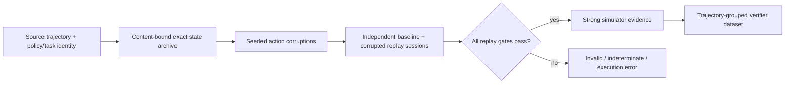
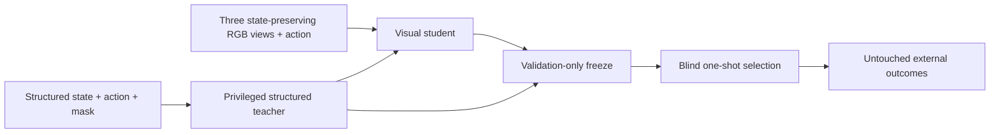
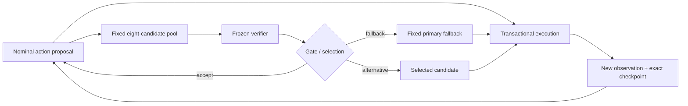
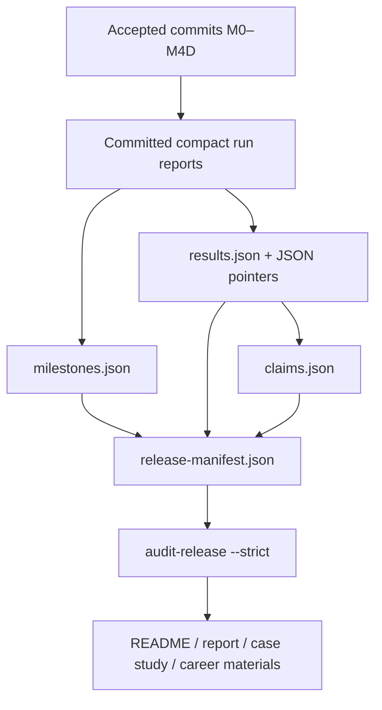

# System architecture

LatentGuard keeps simulator objects outside its core contracts. Typed adapters provide complete state restoration, rendering, task evidence, and action execution; core data, replay, selection, audit, and release code remains simulator-independent.

## Data and evidence pipeline

Archive bytes, leaf inventories, dtypes, shapes, and digests remain exact. The PickCube runtime adapter separately authorizes complete numeric state comparison at a fixed 1e-6 tolerance, with the semantic and tolerance content-bound to compatibility identity.

## Training and evaluation

Provenance, corruption family, candidate type, outcomes, and render-domain identifiers are reporting-only. External M4A images never enter training. Selection manifests, thresholds, checkpoint identities, and candidate pools freeze before external outcomes are available.

## Closed-loop execution

M4C selected repeatedly and exposed over-intervention. M4D accepts nominal by default and distinguishes fallback invocations from other alternatives. Recovery reuses the persisted decision without rescoring; a completed resume executes zero episodes.

## Release and evidence graph

The release audit verifies every referenced commit and file, byte digests, original JSON values, public result IDs, internal links, tracked artifact boundaries, and prohibited claim escalation. Runtime timestamps are excluded from semantic identity.

## Boundary summary

- **Core:** typed JSON/NumPy contracts, deterministic identities, corruption, evaluation, paired replay, selection, transactional storage, and release audit.
- **Adapters:** simulator-specific state, task, render, and action behavior with pinned compatibility evidence.
- **Training:** optional PyTorch code operating only on accepted, split-safe datasets and allowlisted inputs.
- **Remote:** exact pushed SHA execution and large artifacts outside Git; no remote tracked-source editing.
- **Release:** compact committed evidence only. Raw states, RGB, datasets, checkpoints, and caches remain external.
